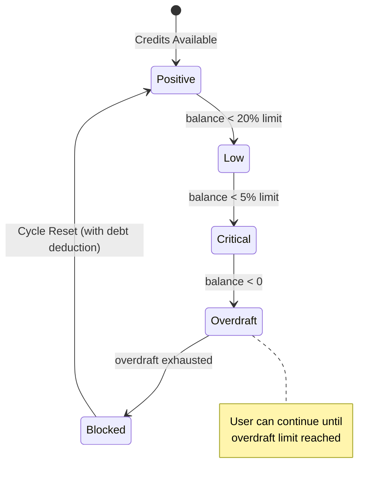

# DEADZONE Buffer — Overdraft Protocol
## Deep Technical Specification

> **Module:** Credit Continuity System  
> **Priority:** High — Prevents User Frustration  
> **Dependencies:** CHRONOLOCK Protocol

---

## 1. Executive Summary

The DEADZONE Buffer is a **grace credit system** that:
1. **Prevents mid-stream cutoffs** during AI responses
2. **Allows small negative balances** to complete in-progress work
3. **Carries debt forward** to the next cycle (not forgiven)
4. **Creates psychological safety** — users don't fear "wasting" their last credits

---

## 2. Core Mechanics

### 2.1 Buffer Calculation

```typescript
// Maximum overdraft = MIN(15% of limit, $0.50 absolute cap)
const calculateMaxOverdraft = (creditsLimit: number): number => {
  const percentageBuffer = creditsLimit * 0.15;  // 15% of limit
  const absoluteCap = 0.50;                       // $0.50 hard cap
  return Math.min(percentageBuffer, absoluteCap);
};

// Examples:
// $2.00 limit (Opus) → $0.30 overdraft max
// $5.00 limit (Pro)  → $0.50 overdraft max (capped)
// $10.00 limit (Flash) → $0.50 overdraft max (capped)
```

### 2.2 States & Transitions



### 2.3 UI Indicators

| State | Balance | UI Treatment |
|-------|---------|--------------|
| **Positive** | > 20% | Green indicator, normal operation |
| **Low** | 5-20% | Yellow indicator, "Credits running low" |
| **Critical** | > 0, < 5% | Orange indicator, "X credits remaining" |
| **Overdraft** | < 0 | Red indicator, "Using overdraft: -$X.XX" |
| **Blocked** | < -max | Red blocked state, countdown to reset |

---

## 3. Database Extensions

```sql
-- Add overdraft tracking columns to user_model_cycles
ALTER TABLE user_model_cycles ADD COLUMN IF NOT EXISTS 
    overdraft_max DECIMAL(10,6) GENERATED ALWAYS AS (
        LEAST(credits_limit * 0.15, 0.50)
    ) STORED;

ALTER TABLE user_model_cycles ADD COLUMN IF NOT EXISTS
    in_overdraft BOOLEAN GENERATED ALWAYS AS (
        credits_remaining < 0
    ) STORED;

ALTER TABLE user_model_cycles ADD COLUMN IF NOT EXISTS
    overdraft_exhausted BOOLEAN GENERATED ALWAYS AS (
        credits_remaining < -overdraft_max
    ) STORED;

-- Function to safely deduct with overdraft
CREATE OR REPLACE FUNCTION safe_deduct_credits(
    p_cycle_id UUID,
    p_amount DECIMAL
) RETURNS TABLE(
    success BOOLEAN,
    new_balance DECIMAL,
    used_overdraft BOOLEAN,
    overdraft_amount DECIMAL,
    is_blocked BOOLEAN
) AS $$
DECLARE
    v_cycle user_model_cycles%ROWTYPE;
    v_max_overdraft DECIMAL;
    v_new_balance DECIMAL;
BEGIN
    -- Lock row
    SELECT * INTO v_cycle FROM user_model_cycles 
    WHERE id = p_cycle_id FOR UPDATE;
    
    v_max_overdraft := LEAST(v_cycle.credits_limit * 0.15, 0.50);
    v_new_balance := v_cycle.credits_remaining - p_amount;
    
    -- Check if this would exceed overdraft
    IF v_new_balance < -v_max_overdraft THEN
        RETURN QUERY SELECT 
            false AS success,
            v_cycle.credits_remaining AS new_balance,
            false AS used_overdraft,
            0::DECIMAL AS overdraft_amount,
            true AS is_blocked;
        RETURN;
    END IF;
    
    -- Apply deduction
    UPDATE user_model_cycles 
    SET credits_remaining = v_new_balance,
        credits_consumed_this_cycle = credits_consumed_this_cycle + p_amount,
        overdraft_used_this_cycle = overdraft_used_this_cycle OR (v_new_balance < 0),
        updated_at = NOW()
    WHERE id = p_cycle_id;
    
    RETURN QUERY SELECT 
        true AS success,
        v_new_balance AS new_balance,
        (v_new_balance < 0) AS used_overdraft,
        GREATEST(0, -v_new_balance) AS overdraft_amount,
        false AS is_blocked;
END;
$$ LANGUAGE plpgsql;
```

---

## 4. Streaming Protection System

### 4.1 The Problem

AI responses stream token-by-token. A 2,000-token response might take 10 seconds. If credits run out mid-stream:
- User gets incomplete response
- They're charged for what they got
- Experience is frustrating

### 4.2 The Solution: Credit Reservation

```typescript
// services/streaming-protection.ts

export interface StreamingReservation {
  reservationId: string;
  userId: string;
  modelId: string;
  reservedAmount: number;
  actualUsed: number;
  status: 'active' | 'settled' | 'refunded';
  createdAt: Date;
}

export class StreamingProtectionService {
  
  /**
   * Before streaming begins, reserve worst-case credits
   */
  async reserveCredits(
    userId: string,
    modelId: string,
    estimatedMaxCost: number
  ): Promise<{ 
    reservationId: string; 
    approved: boolean; 
    reason?: string 
  }> {
    const cycle = await this.chronolock.getCycleStatus(userId, modelId);
    
    // Calculate available including overdraft
    const available = cycle.creditsRemaining + cycle.overdraftAvailable;
    
    if (estimatedMaxCost > available) {
      // Allow partial if they have SOME credits (don't block entirely)
      if (available > 0) {
        // Warn user: "Response may be truncated due to credit limit"
        return {
          reservationId: await this.createReservation(userId, modelId, available),
          approved: true,
          reason: `Limited to ${available.toFixed(4)} credits. Response may be shortened.`
        };
      }
      
      return {
        reservationId: '',
        approved: false,
        reason: 'Insufficient credits to begin response'
      };
    }
    
    // Full reservation approved
    return {
      reservationId: await this.createReservation(userId, modelId, estimatedMaxCost),
      approved: true
    };
  }
  
  /**
   * During streaming, track actual usage
   */
  async updateUsage(reservationId: string, tokensUsed: number, costSoFar: number) {
    await this.supabase
      .from('streaming_reservations')
      .update({ actual_used: costSoFar })
      .eq('id', reservationId);
  }
  
  /**
   * After streaming completes, settle the reservation
   * Refund unused reserved credits
   */
  async settleReservation(
    reservationId: string,
    finalCost: number,
    tokenDetails: { input: number; output: number; cached?: number }
  ): Promise<{ refunded: number }> {
    const reservation = await this.getReservation(reservationId);
    
    if (!reservation) throw new Error('Reservation not found');
    
    // Calculate refund
    const refund = reservation.reservedAmount - finalCost;
    
    // Deduct only the actual cost
    await this.chronolock.deductCredits(
      reservation.userId,
      reservation.modelId,
      finalCost,
      reservationId,
      tokenDetails
    );
    
    // Mark reservation as settled
    await this.supabase
      .from('streaming_reservations')
      .update({ 
        status: 'settled', 
        actual_used: finalCost,
        settled_at: new Date().toISOString()
      })
      .eq('id', reservationId);
    
    return { refunded: refund };
  }
  
  /**
   * If streaming fails/aborts, refund full reservation
   */
  async cancelReservation(reservationId: string): Promise<void> {
    await this.supabase
      .from('streaming_reservations')
      .update({ status: 'refunded' })
      .eq('id', reservationId);
    
    // No credits were actually deducted yet, so nothing to refund
  }
}
```

### 4.3 Database Schema for Reservations

```sql
CREATE TABLE streaming_reservations (
    id UUID PRIMARY KEY DEFAULT gen_random_uuid(),
    user_id UUID NOT NULL REFERENCES users(id),
    model_id TEXT NOT NULL,
    cycle_id UUID REFERENCES user_model_cycles(id),
    
    reserved_amount DECIMAL(10,6) NOT NULL,
    actual_used DECIMAL(10,6) DEFAULT 0,
    
    status TEXT NOT NULL DEFAULT 'active',  -- 'active', 'settled', 'refunded'
    
    created_at TIMESTAMPTZ DEFAULT now(),
    settled_at TIMESTAMPTZ,
    
    CONSTRAINT valid_status CHECK (status IN ('active', 'settled', 'refunded'))
);

CREATE INDEX idx_reservations_active ON streaming_reservations(user_id, status) 
WHERE status = 'active';

-- Cleanup old reservations (cron job)
CREATE OR REPLACE FUNCTION cleanup_stale_reservations() RETURNS void AS $$
BEGIN
    -- Mark hour-old active reservations as refunded (something went wrong)
    UPDATE streaming_reservations
    SET status = 'refunded'
    WHERE status = 'active' 
    AND created_at < NOW() - INTERVAL '1 hour';
END;
$$ LANGUAGE plpgsql;
```

---

## 5. Cycle Reset with Debt Carryover

### 5.1 Reset Logic

When a cycle resets:
1. Check if overdraft was used (`credits_remaining < 0`)
2. Calculate debt: `debt = ABS(credits_remaining)`
3. New cycle credits = `credits_limit - debt`
4. Log the carryover for transparency

```typescript
async resetCycleWithDebt(cycleId: string): Promise<UserModelCycle> {
  const cycle = await this.getCycle(cycleId);
  
  // Calculate debt
  const debt = cycle.creditsRemaining < 0 ? Math.abs(cycle.creditsRemaining) : 0;
  const newCredits = cycle.creditsLimit - debt;
  
  // Reset cycle
  const { data } = await this.supabase
    .from('user_model_cycles')
    .update({
      cycle_start_at: null,  // Will be set on next request
      cycle_number: cycle.cycleNumber + 1,
      credits_remaining: newCredits,
      credits_consumed_this_cycle: 0,
      overdraft_used_this_cycle: false,
      updated_at: new Date().toISOString(),
    })
    .eq('id', cycleId)
    .select()
    .single();
  
  // Log the reset with debt info
  await this.logTransaction({
    userId: cycle.userId,
    modelId: cycle.modelId,
    cycleId: cycle.id,
    type: 'reset',
    amount: newCredits,
    balanceBefore: cycle.creditsRemaining,
    balanceAfter: newCredits,
    metadata: {
      debtCarried: debt,
      originalLimit: cycle.creditsLimit,
      wasInOverdraft: debt > 0,
    }
  });
  
  return this.mapToCycle(data);
}
```

### 5.2 User Notification on Reset

```tsx
// components/ai/CycleResetNotification.tsx

export function CycleResetNotification({ 
  modelId, 
  newCredits, 
  debtCarried 
}: { 
  modelId: string; 
  newCredits: number; 
  debtCarried: number 
}) {
  if (debtCarried === 0) {
    return (
      <Toast variant="success">
        <ToastTitle>Cycle Reset</ToastTitle>
        <ToastDescription>
          {modelId} credits restored to ${newCredits.toFixed(2)}
        </ToastDescription>
      </Toast>
    );
  }
  
  return (
    <Toast variant="warning">
      <ToastTitle>Cycle Reset (with carryover)</ToastTitle>
      <ToastDescription>
        <p>{modelId} cycle reset.</p>
        <p className="text-sm text-amber-200">
          Previous overdraft of ${debtCarried.toFixed(4)} deducted.
        </p>
        <p>New balance: ${newCredits.toFixed(2)}</p>
      </ToastDescription>
    </Toast>
  );
}
```

---

## 6. Use Cases

### Scenario A: Graceful Completion

**Context:** Student "Sam" has $0.05 remaining in Opus credits. They send a complex prompt that generates a $0.12 response.

**Flow:**
1. Pre-check: $0.05 remaining + $0.30 overdraft = $0.35 available
2. Estimated cost ($0.15) < Available ($0.35) → Approved
3. Request processed, actual cost = $0.12
4. New balance: $0.05 - $0.12 = **-$0.07** (in overdraft)
5. UI shows: "Using overdraft: -$0.07 / -$0.30 max"
6. Sam can continue until hitting -$0.30

**Outcome:** Response completes fully. Sam isn't frustrated by cutoff.

---

### Scenario B: Overdraft Exhaustion

**Context:** Student "Jordan" has abused overdraft and is at -$0.28 of -$0.30 max.

**Flow:**
1. Jordan sends another prompt (estimated $0.05)
2. Pre-check: -$0.28 + remaining overdraft ($0.02) = $0.02 available
3. $0.05 > $0.02 → **BLOCKED**
4. UI shows:
   - "Overdraft exhausted. Opus resets in 14h 23m"
   - "Switch to another model or wait for reset"
5. Options: Switch to Pro/Flash, or use Orbit Points buyback

**Outcome:** Hard stop prevents unlimited debt accumulation.

---

### Scenario C: Debt Carryover Transparency

**Context:** Student "Taylor" used $0.15 overdraft last cycle. Cycle resets.

**Flow:**
1. Old cycle ends with balance = -$0.15
2. Reset triggers:
   - debt = $0.15
   - new_credits = $2.00 - $0.15 = **$1.85**
3. Notification:
   ```
   ╔════════════════════════════════════════╗
   ║  Opus Cycle Reset                      ║
   ║  Previous overdraft: $0.15 (deducted)  ║
   ║  New balance: $1.85 / $2.00            ║
   ╚════════════════════════════════════════╝
   ```
4. Transaction logged for audit trail

**Outcome:** User understands exactly why they have less than full credits.

---

## 7. Anti-Abuse Measures

### 7.1 Velocity Detection

Track overdraft usage patterns:

```sql
-- Flag users who consistently max out overdraft
CREATE VIEW overdraft_abuse_candidates AS
SELECT 
    user_id,
    COUNT(*) as cycles_with_overdraft,
    AVG(CASE WHEN credits_remaining < 0 THEN ABS(credits_remaining) ELSE 0 END) as avg_overdraft,
    MAX(ABS(credits_remaining)) as max_overdraft
FROM user_model_cycles
WHERE overdraft_used_this_cycle = true
GROUP BY user_id
HAVING COUNT(*) >= 3  -- At least 3 cycles with overdraft
AND AVG(CASE WHEN credits_remaining < 0 THEN ABS(credits_remaining) ELSE 0 END) > 0.20;  -- Avg > $0.20
```

### 7.2 Progressive Limits

For users flagged as potential abusers:

```typescript
const getOverdraftLimit = async (userId: string): Promise<number> => {
  const abuseScore = await getAbuseScore(userId);
  
  if (abuseScore > 0.8) {
    return 0;  // No overdraft for high-risk users
  }
  if (abuseScore > 0.5) {
    return 0.25;  // Reduced overdraft
  }
  return 0.50;  // Standard overdraft
};
```

### 7.3 Admin Override

Admins can:
- Disable overdraft for specific users
- Set custom overdraft limits per user
- View overdraft usage analytics
- Forgive overdraft debt in exceptional cases
