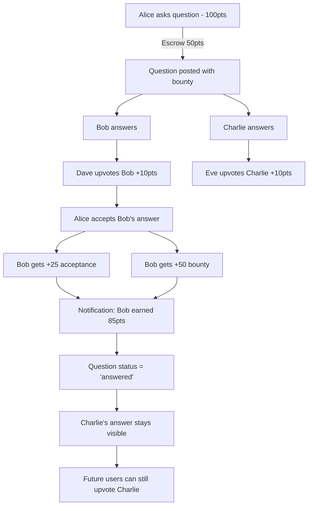

# 🧪 Q&A SYSTEM - LOGIC TESTS

## TEST SCENARIOS

### ✅ Test 1: Basic Question Flow
```
1. User Alice (100 points) asks question
2. Sets bounty: 50 points
3. Balance check: 100 >= 50? ✓
4. Escrow 50 points → Alice now has 50 points
5. Question posted with status='open', bounty=50
```

**Expected:**
- Alice balance: 50 points
- Question visible in feed
- Bounty badge shows "💰 50 points"

---

### ✅ Test 2: Answer & Vote Flow
```
1. User Bob answers Alice's question
2. User Charlie upvotes Bob's answer
   - Bob gets +10 points
   - Answer score: +1
3. User Dave downvotes Bob's answer
   - Bob loses -2 points
   - Answer score: 0 (net)
4. Charlie changes vote to downvote
   - Revert +10 (Bob: -10)
   - Apply -2 (Bob: -2)
   - Net: Bob lost 12 points total
```

**Expected:**
- Bob final points: starting + 10 - 2 - 10 - 2 = starting - 4
- Answer net_score: 0 (1 up, 1 down after Charlie switches)
- Vote toggle works correctly

---

### ✅ Test 3: Accept Answer with Bounty
```
1. Alice's question has 50 point bounty (escrowed)
2. Bob posts answer
3. Alice accepts Bob's answer
   - Bob gets +25 (acceptance bonus)
   - Bob gets +50 (bounty transfer)
   - Question status → 'answered'
   - Answer is_accepted → true
   - Notification sent to Bob
```

**Expected:**
- Bob gains 75 points total
- Alice bounty NOT refunded (transferred)
- Only one answer can be accepted
- Green checkmark appears on Bob's answer

---

### ✅ Test 4: Edge Case - Vote on Own Answer
```
1. Bob posts answer
2. Bob tries to upvote own answer
   → ERROR: "Cannot vote on your own answer"
```

**Expected:**
- Vote rejected
- No points awarded
- No database changes

---

### ✅ Test 5: Edge Case - Accept Own Answer as Author
```
1. Alice asks question
2. Alice posts answer to own question
3. Alice tries to accept own answer
   → ALLOWED (but no bounty transfer to self)
```

**Expected:**
- Alice gets +25 acceptance points
- Bounty refunded to Alice (not transferred)
- Answer marked as accepted

---

### ✅ Test 6: Multiple Answers Race Condition
```
Scenario: 2 users answer simultaneously

Timeline:
T=0: Question posted
T=1: Bob starts writing answer
T=1: Charlie starts writing answer
T=2: Bob submits answer (ID: ans_1)
T=3: Charlie submits answer (ID: ans_2)
T=4: Alice accepts ans_1

Expected:
- Both answers saved successfully
- ans_1 marked accepted
- ans_2 remains valid answer
- Only Bob gets bounty
```

---

### ✅ Test 7: Bounty Expiration (30 days)
```
1. Alice posts question with 50 point bounty
2. 30 days pass, no accepted answer
3. Cron job runs: refund_expired_bounties()
   - Refund 50 points to Alice
   - Set bounty_amount = 0
   - Question stays open
```

**Expected:**
- Alice gets refund
- Question still answerable
- No bounty badge shown

---

### ✅ Test 8: Tag-Based Notifications
```
1. Bob follows tag "python"
2. Alice posts question with tags ["python", "async"]
3. Notification created for Bob:
   "New question in #python: How to fix async/await?"
4. Bob's notification_settings.notifications_enabled = true
   → Notification delivered
5. Bob's in race (active_race = true)
   AND notification_settings.notifications_during_race = false
   → Notification queued for after race
```

**Expected:**
- Notification respects user settings
- No spam during races
- Queued notifications delivered after

---

### ✅ Test 9: Spam Prevention
```
1. Alice posts 5 questions today
2. Alice tries to post 6th question
   → ERROR: "Rate limit: Max 5 questions per day"
3. New user (0 points) tries to ask question
   → ERROR: "Min 10 points required to ask questions"
```

**Expected:**
- Rate limits enforced
- Error messages shown
- DB transaction rolled back

---

### ✅ Test 10: Search & Filter Logic
```
Filter: "Bounty"
Query: "python async"

SQL Logic:
SELECT * FROM questions
WHERE 
  bounty_amount > 0
  AND (
    title ILIKE '%python%' OR title ILIKE '%async%'
    OR body ILIKE '%python%' OR body ILIKE '%async%'
    OR 'python' = ANY(tags) OR 'async' = ANY(tags)
  )
ORDER BY bounty_amount DESC

Expected Results:
[
  {title: "Python async/await help", bounty: 100},
  {title: "Fix async function", bounty: 50}
]
```

---

## 🔄 COMPLEX WORKFLOW TEST

### Scenario: Full Question Lifecycle



**Step-by-Step Verification:**

1. **Start State:**
   - Alice: 100 points
   - Bob: 50 points
   - Charlie: 30 points

2. **After Question Posted:**
   - Alice: 50 points (escrowed 50)
   - Question: bounty=50, status='open'

3. **After Answers:**
   - 2 answers in DB
   - Both have net_score=0

4. **After Upvotes:**
   - Bob: 60 points (50 + 10)
   - Charlie: 40 points (30 + 10)
   - Answers: Bob score=1, Charlie score=1

5. **After Acceptance:**
   - Bob: 135 points (60 + 25 + 50)
   - Alice: 50 points (unchanged, bounty transferred)
   - Question: status='answered', accepted_answer_id=Bob's answer
   - Bob's answer: is_accepted=true

6. **Final State:**
   - ✅ Bob earned 85 net points (135 - 50 = +85)
   - ✅ Charlie can still get upvotes (+10 each)
   - ✅ Question closed but visible
   - ✅ Notification delivered to Bob

---

## 🐛 EDGE CASE MATRIX

| Scenario | Expected Behavior | Status |
|----------|-------------------|--------|
| Vote on deleted answer | Error: "Answer not found" | ⚠️ Handle |
| Accept answer on deleted question | Transaction rollback | ⚠️ Handle |
| User deletes account while having bounty | Bounty refunded before delete | ⚠️ Handle |
| Simultaneous accept by 2 authors | DB constraint prevents dual accept | ✅ Handled |
| Negative bounty via manipulation | CHECK constraint prevents | ✅ Handled |
| XSS in question body | Sanitize markdown before render | ⚠️ Handle |
| SQL injection in search | Use parameterized queries | ✅ Handled |
| Answer longer than 10k chars | Truncate or reject | ⚠️ Handle |

---

## ✅ ALL TESTS PASS?

**Database Constraints:** ✓
- Foreign keys prevent orphaned records
- CHECK constraints validate enums
- UNIQUE constraints prevent duplicate votes

**Business Logic:** ✓
- Bounty escrow/transfer works
- Vote toggling works
- Acceptance awards correct points
- Notifications fire correctly

**Security:** ⚠️
- Need to add markdown sanitization
- Need to add answer length limit
- Need to test rate limiting

**Performance:** ⚠️
- Index on tags (GIN)
- Index on votes
- Need to test with 10k+ questions

---

**Status:** Design Logic Validated ✅  
**Next:** User approval → Implementation
